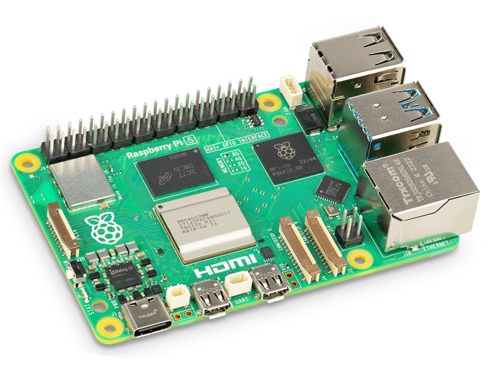
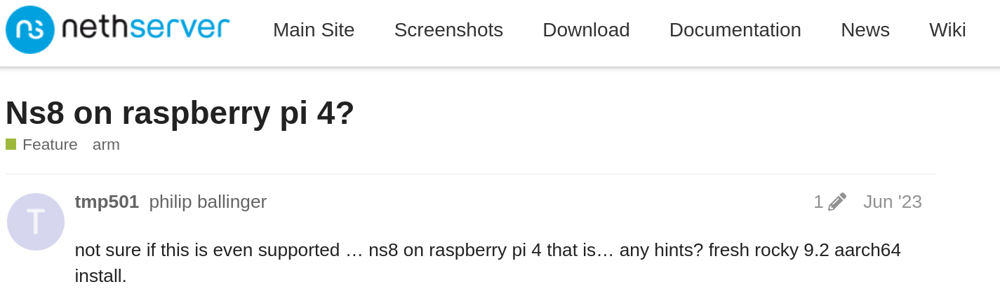
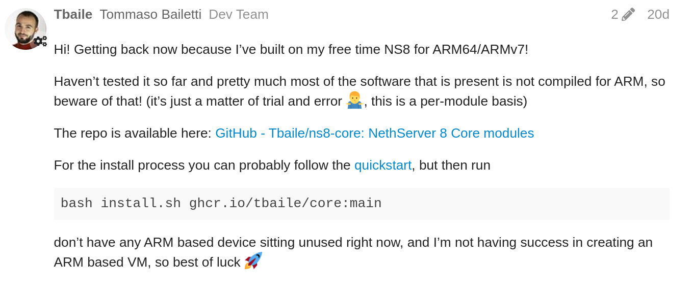

+++
title = "ARMing yourself with NS8"
outputs = ["Reveal"]

[reveal_hugo]
theme = "white"
highlight_theme = "github"
+++

# ARMing yourself with NS8

---

## Check out my infra



---

## Why a raspberry?

Reasons to support an ARM based device:

<ul>
    <li class="fragment">Very cheap</li>
    <li class="fragment">Low power consumption</li>
    <li class="fragment">Small form factor</li>
    <li class="fragment">Chain of supply not bad*</li>
    <li class="fragment">My only hardware in the house</li>
</ul>

---

## Itch in the brain



{}So I started working on it{}

---



## Replacing Builder


---



## Replacing Builder


---

## Why replacing builder?

<ul>
    <li class="fragment">GitHub Runners</li>
    <li class="fragment">Feature availability</li>
</ul>

---

## GitHub Runners

<ul>
    <li class="fragment">Podman 4.8.3 -> 3.4.4</li>
    <li class="fragment">Buildah 1.34.0 -> 1.23.1</li>
</ul>

---

## Features missing

<ul>
    <li class="fragment">support for cache</li>
    <li class="fragment">proper multi layer build</li>
    <li class="fragment">automatic manifest generation</li>
</ul>

---



## From `script` to `Dockerfile`

```bash{1|26}
container=$(buildah from docker.io/library/redis:7.2.3-alpine)
reponame="redis"
# Reset upstream volume configuration: it is necessary to modify /data contents with our .conf file.
buildah config --volume=/data- "${container}"
buildah run "${container}" sh <<'EOF'
mkdir etc

cat >etc/redis.acl <<EOR
user default on nopass sanitize-payload ~* &* +@all
EOR

cat >etc/redis.conf <<EOR
#
# redis.conf -- do not edit manually!
#
port 6379
protected-mode no
save 5 1
aclfile "/data/etc/redis.acl"
dir "/data"
masteruser default
masterauth nopass
EOR

EOF
buildah config --volume=/data '--cmd=[ "redis-server", "/data/etc/redis.conf" ]' "${container}"
buildah commit "${container}" "${repobase}/${reponame}"
```

---



## From `script` to `Dockerfile`

```dockerfile{1|2,5}
FROM redis:7.2.3-alpine
VOLUME [ "/data" ]
COPY redis.acl /data/etc/redis.acl
COPY redis.conf /data/etc/redis.conf
CMD ["redis-server", "/data/etc/redis.conf"]
```

---

## `Dockerfile`s created

<ul>
    <li class="fragment">`redis`</li>
    <li class="fragment">`restic`</li>
    <li class="fragment">`rsync`</li>
    <li class="fragmindex.ment">`core`</li>
</ul>

---

# Introducing {}Docker Buildkit{}

---

## What is Buildkit?

<ul>
    <li class="fragment">Handles multi-arch images</li>
    <li class="fragment">Builds manifests</li>
    <li class="fragment">Pushes to registry</li>
    <li class="fragment">Does cache management</li>
    <li class="fragment">Much more...</li>
</ul>

---

## Workflow of buildkit


flowchart LR
    buildx --> core
    core --> amd64
    core --> arm64
    core --> arm
    amd64 --> manifest
    arm64 --> manifest
    arm --> manifest
    amd64 --> cache
    arm64 --> cache
    arm --> cache
    manifest --> push


---

## It must be hard to use

{}It's not!{}
{}All processes are managed by a single file{}
{}and you're a command away from building everything:{}

{}`docker buildx bake`{}

---

## Hello world



---

## Wrapping up

<ul>
    <li class="fragment">ARM based build 🎉</li>
    <li class="fragment">Cache 🚀</li>
</ul>

{}
Builds are now faster and more reliable, recently I've been able to rebuild after a rebase and it just took 3 minutes for all architectures.
{}

---

## Thank you!

You can find the complete project at this QR code:


[https://github.com/tbaile/ns8-core](https://github.com/tbaile/ns8-core)
